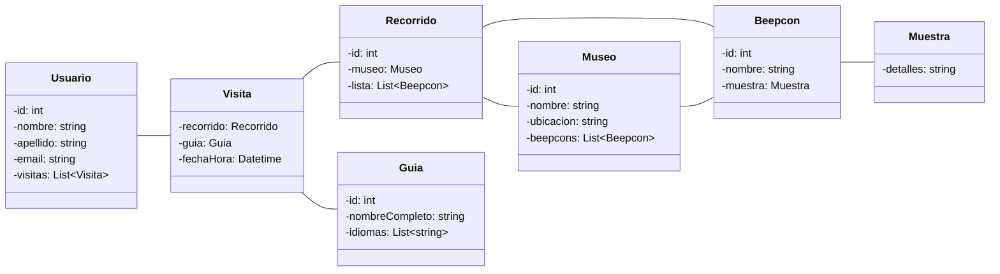

```mermaid
classDiagram
    direction LR

    class Usuario{
        -id: int
        -nombre: string
        -apellido: string
        -email: string
        -visitas: List~Visita~
    }
    
    class Visita{
        -recorrido: Recorrido
        -guia: Guia
        -fechaHora: Datetime
    }

    class Recorrido{
        -id: int
        -museo: Museo
        -lista: List~Beepcon~
    }

    class Guia{
        -id: int
        -nombreCompleto: string
        -idiomas: List~string~
    }

    class Museo{
        -id: int
        -nombre: string
        -ubicacion: string
        -beepcons: List~Beepcon~
    }

    class Beepcon{
        -id: int
        -nombre: string
        -muestra: Muestra
    }

    class Muestra{
        -detalles: string
    }

    Usuario -- Visita

    Visita -- Recorrido

    Visita -- Guia

    Recorrido -- Beepcon

    Museo -- Beepcon

    Recorrido -- Museo

    Beepcon -- Muestra

```
