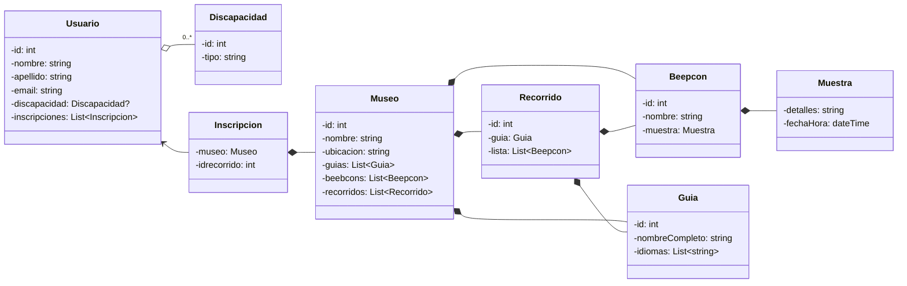

```mermaid
classDiagram
    direction LR
    class Museo{
        -id: int
        -nombre: string
        -ubicacion: string
        -guias: List~Guia~
        -beebcons: List~Beepcon~
        -recorridos: List~Recorrido~
    }

    class Beepcon{
        -id: int
        -nombre: string
        -muestra: Muestra
    }

    class Muestra{
        -detalles: string
        -fechaHora: dateTime
    }

    class Recorrido{
        -id: int
        -guia: Guia
        -lista: List~Beepcon~
    }

    class Usuario{
        -id: int
        -nombre: string
        -apellido: string
        -email: string
        -discapacidad: Discapacidad?
        -inscripciones: List~Inscripcion~
    }

    class Discapacidad{
        -id: int
        -tipo: string
    }

    class Guia{
        -id: int
        -nombreCompleto: string
        -idiomas: List~string~
    }

    class Inscripcion{
        -museo: Museo
        -idrecorrido: int

    }

    Museo *-- Beepcon
    Museo *-- Recorrido
    Museo *-- Guia

    Inscripcion *-- Museo

    Recorrido *-- Guia
    Recorrido *-- Beepcon

    Beepcon *-- Muestra

    Usuario o-- "0..*" Discapacidad
    Usuario <-- Inscripcion
```
