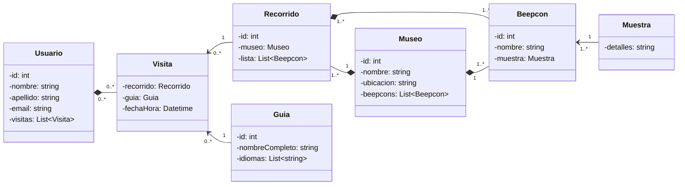

```mermaid
classDiagram
    direction LR
    
    class Usuario{
        -id: int
        -nombre: string
        -apellido: string
        -email: string
        -visitas: List~Visita~
    }

    class Visita{
        -recorrido: Recorrido
        -guia: Guia
        -fechaHora: Datetime
    }

    class Recorrido{
        -id: int
        -museo: Museo
        -lista: List~Beepcon~
    }

    class Guia{
        -id: int
        -nombreCompleto: string
        -idiomas: List~string~
    }

    class Museo{
        -id: int
        -nombre: string
        -ubicacion: string
        -beepcons: List~Beepcon~
    }

    class Beepcon{
        -id: int
        -nombre: string
        -muestra: Muestra
    }

    class Muestra{
        -detalles: string
    }

    Usuario "0..*" *-- "0..*" Visita

    Visita "0..*" <-- "1" Recorrido

    Visita "0..*" <-- "1" Guia
    
    Recorrido "1..*" *-- "1..*" Beepcon
    
    Museo "1" *-- "1..*" Beepcon
    
    Recorrido "1..*" --* "1" Museo
    
    Beepcon "1..*" <-- "1" Muestra

```